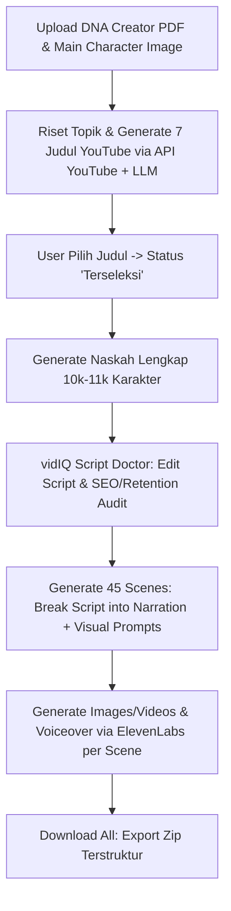

# Implementation Plan: YouTube Content Generator Dashboard ("Orchestra Dashboard")

Berdasarkan analisis dokumen `assets/docs/prompt.md`, `assets/docs/generate-script.md`, dan visual mockup dashboard pada `assets/image/mockup dashboard.jpeg`, berikut adalah rencana arsitektur dan langkah pengembangan aplikasi dashboard berbasis web untuk mengotomatisasi pembuatan script, visual, dan voiceover YouTube.

---

## 🎯 Ringkasan Analisis & Alur Kerja Sistem

Aplikasi dirancang sebagai **Orchestra Dashboard** bertema gelap (dark mode modern) yang memandu pembuat konten dari tahap riset hingga ekspor aset siap edit.



---

## 🔑 Hal-Hal Yang Harus Disiapkan Oleh User

Sebelum memulai pengembangan full-stack backend & integrasi API, berikut beberapa akun, API key, dan berkas sampel yang perlu Anda siapkan:

### 1. API Keys & Akses Layanan AI
- **YouTube Data API v3 Key**: Untuk ekstraksi data video kompetitor, tren, dan generasi judul CTR tinggi.
- **LLM & Multimodal API Key (Google AI Studio / Gemini API Key)**: 
  - **Scripting & Analysis**: Ekstraksi PDF DNA Creator, pembuat naskah (10k-11k karakter), SEO audit, serta breaking script ke 45 scene.
  - **Image Generation & Editing (Google Nano Banana)**: Untuk generate gambar scene dan pengeditan berbasis prompt dengan mempertahankan konsistensi karakter utama (*main character*).
  - **Video Generation (Google Veo / Gemini Omni Flash)**: Untuk konversi text/image ke video scene berdurasi pendek secara otomatis.
- **ElevenLabs API Key & Voice ID**: Untuk pembuatan narasi *voiceover* otomatis per scene.
- **Alternatif Image/Video API** *(Opsional)*: Fal.ai / Replicate / Midjourney / DALL-E 3 jika ingin menggunakan provider tambahan.

### 2. Berkas Awal (Assets & Templates)
- **File PDF DNA Creator**: Contoh dokumen PDF analisis pola pikir & gaya bicara kreator.
- **File Gambar Main Character**: Foto/gambar karakter animasi utama (PNG/JPG) yang akan menjadi referensi visual scene.

### 3. Lingkungan Pengembang (Environment)
- Python 3.10+ dengan virtual environment (`venv`).
- Dependensi tambahan: `streamlit`, `google-api-python-client`, `elevenlabs`, `pypdf`/`pdfplumber`, `pillow`, `requests`, `python-dotenv`.

---

## ⚠️ User Review Required

> [!IMPORTANT]
> **Pilihan Framework UI**:
> Saat ini project memiliki basis `app.py` menggunakan **Streamlit** dengan styling custom vidIQ. Apakah Anda ingin tetap menggunakan **Streamlit** (dioptimalkan dengan komponen visual kustom sesuai `mockup dashboard.jpeg`) atau beralih ke stack **Vite/React + FastAPI**?
> *(Catatan: Streamlit memungkinkan pengerjaan lebih cepat dan cepat di-deploy).*

> [!NOTE]
> **Penyimpanan Database & State**:
> Untuk menyimpan judul `Pending` vs `Terseleksi`, riwayat job, file PDF DNA, dan 45 scene per job, disarankan menggunakan database SQLite lokal (`sqlite3` + `SQLAlchemy` atau `json` store) di folder `data/` project.

---

## 🙋 Open Questions

> [!QUESTION]
> 1. **Layanan Image & Video Generation API**: API mana yang Anda prioritaskan untuk pembuatan gambar scene (misal: Fal.ai / Replicate / OpenAI DALL-E / Stability)?
> 2. **Preset Voiceover ElevenLabs**: Apakah Voice ID ElevenLabs disetting global di `.env` atau bisa dipilih di UI per DNA Creator?

---

## 🛠️ Proposed Changes

Aplikasi akan dikembangkan secara bertahap pada struktur berkas berikut:

```
vidiq-00/
├── app.py                      # Entri utama Streamlit dashboard
├── requirements.txt            # Dependensi python terbaru
├── .env.example                # Template API Keys (YouTube, LLM, ElevenLabs, Image API)
├── core/
│   ├── __init__.py
│   ├── dna_parser.py           # Parser PDF DNA Creator & Character reference manager
│   ├── youtube_service.py      # Integration dengan YouTube Data API v3 & Title generator
│   ├── script_generator.py     # Generator naskah 10k-11k karakter sesuai DNA
│   ├── script_doctor.py        # SEO Audit & Retention Trimming (vidIQ engine)
│   ├── scene_splitter.py       # Engine pemecah script menjadi 45 scenes
│   ├── voiceover_service.py    # Integrasi ElevenLabs TTS API
│   ├── image_service.py        # Integrasi AI Image Generation API
│   └── exporter.py             # Packaging zip folder terstruktur (youtube/nama-folder/...)
└── data/                       # Database SQLite lokal & temporary audio/image storage
```

---

### [Component 1] Core Services & Pipeline APIs

#### [NEW] [dna_parser.py](file:///d:/Projects/vidiq-00/core/dna_parser.py)
- Membaca dan mengekstraksi teks dari PDF DNA Creator.
- Menyimpan profil DNA dan link/path Main Character Image.

#### [NEW] [youtube_service.py](file:///d:/Projects/vidiq-00/core/youtube_service.py)
- Mengambil tren YouTube API v3 dan menghasilkan 7 ide judul berpotensi CTR tinggi + alasan.
- Mengelola status judul (`Pending` vs `Terseleksi`).

#### [NEW] [script_generator.py](file:///d:/Projects/vidiq-00/core/script_generator.py)
- Prompt engineering untuk menghasilkan naskah 10,000–11,000 karakter berstruktur Hook, Problem, Unique Insight, Solution, Case Study, & CTA sesuai DNA.

#### [NEW] [scene_splitter.py](file:///d:/Projects/vidiq-00/core/scene_splitter.py)
- Memecah naskah yang sudah disimpan menjadi 45 scene berurutan.
- Otomatis menghasilkan **Narasi** dan **Visual Prompt** per scene berdasarkan style yang dipilih (Photorealistic, Pencil Sketch, Cartoon, Infographic).

#### [NEW] [voiceover_service.py](file:///d:/Projects/vidiq-00/core/voiceover_service.py)
- Memanggil API ElevenLabs untuk generate file MP3 narasi scene demi scene.

#### [NEW] [image_service.py](file:///d:/Projects/vidiq-00/core/image_service.py)
- Mengirim prompt visual scene + reference image main karakter ke API image generator.

#### [NEW] [exporter.py](file:///d:/Projects/vidiq-00/core/exporter.py)
- Membuat file ZIP berstruktur:
  - `youtube/<job-title>/video/scene_01.mp4 ...`
  - `youtube/<job-title>/gambar/scene_01.png ...`
  - `youtube/<job-title>/voiceover/scene_01.mp3 ...`

---

### [Component 2] UI & Dashboard Implementation

#### [MODIFY] [app.py](file:///d:/Projects/vidiq-00/app.py)
- Mendesain ulang UI Streamlit persis sesuai tampilan `assets/image/mockup dashboard.jpeg`:
  - Selector "Lanjutkan job sebelumnya"
  - Input Topik + Visual Style Cards (Photorealistic, Pencil Sketch, Cartoon, Infographic)
  - Editorial Intro Textarea & Button Simpan
  - Tombol "Generate All Scenes" dengan progress bar (45/45 done)
  - Layout Card Scene 1 s/d 45 dengan Narasi, Visual Prompt, dan tombol Generate/Status.
  - Tab / Modul upload DNA Creator PDF & Main Character Image.
  - Tombol "Download All Assets (ZIP)".

---

## 🧪 Verification Plan

### Automated / Integration Tests
- Validasi parser PDF DNA Creator.
- Unit test pemecah 45 scene (`scene_splitter.py`) memastikan pembagian rasional naskah 10k karakter.
- Test integrasi API ElevenLabs (mock / real small call).
- Test kemasan file ekspor ZIP terstruktur.

### Manual Verification
- Uji coba end-to-end melalui UI Dashboard: Upload DNA -> Masukkan Topik -> Pilih Judul -> Generate Script -> Edit & Audit -> Generate 45 Scenes -> Test Download ZIP.
